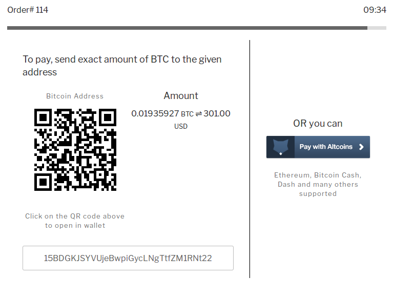
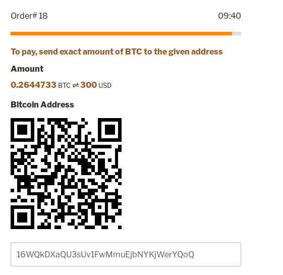
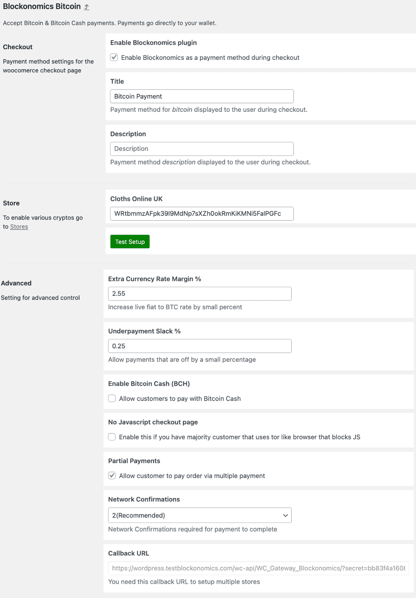

# Wordpress Bitcoin Payments - Blockonomics # 
**Contributors:** juhasiivikko, darrenwestwood, blockonomics
**Tags:** bitcoin, accept bitcoin, bitcoin woocommerce, bitcoin wordpress plugin, bitcoin payments 
**Requires at least:** 3.0.1 
**Tested up to:** 5.7
**Stable tag:** 3.3
**License:** MIT 
**License URI:** http://opensource.org/licenses/MIT 

Accept bitcoin payments and altcoins on your WooCommerce website. Bitcoin payments go directly to your wallet. 

## Description ## 

The fastest and easiest way to start accepting Bitcoin payments on your WooCommerce online store. Since 2015, [Blockonomics](https://www.blockonomics.co/merchants?utm_source=wordpress) has helped thousands of ecommerce sites increase sales by including Bitcoin and Bitcoin Cash as payment options for their customers. 

### A truly decentralized bitcoin payment processor for WordPress ### 

Blockonomics is the only Bitcoin payment gateway that enables full decentralization in the e-commerce industry. Purchases made to your website are instantly sent to your wallet, rather than to a payment gateway wallet. This not only saves you fees when taking your coins out, but it allows you to take ownership of your revenue without the need for a middle man. Never lose revenue from payment gateway wallet hacks - **be your own bank**! 

### Accept bitcoin payments, fast & easy ### 
- Payments are received **directly into your wallet** 
- **No approvals** of API key/documentation required 
- **Safe and secure** transactions 
- Installation only takes **two minutes** - [Video Tutorial](https://www.youtube.com/watch?v=nFKzzMgdBpQ)  
- Eliminate chargebacks and fraud 
- **World-class** customer support team 

### Built for bitcoin merchants ### 
- Accept Bitcoin (BTC) and Bitcoin Cash (BCH)
- **Segwit compatibility** enables the lowest transaction fees possible 
- All major HD wallets, such as Trezor, Ledger Nano S, Blockchain.info and Mycelium are supported 
- Supports **all major fiat currencies** 
- Complete checkout process happens within your website/theme
- **Privacy friendly** - Customer order information remains private to your shop and is never submitted to Blockonomics
- Callbacks to TOR websites supported

## Installation ## 

You can operate the plugin in two different modes:  

### Default Mode  ###
- There is **no installation** procedure required. Blockonomics automatically starts working in this mode on activation of plugin 
- Bitcoin payments go to a Blockonomics temporary wallet   
- To withdraw received funds, user has to change to *Direct to Wallet* mode

### Direct to Wallet Mode (Recommended)  ### 
[Video Tutorial](https://www.youtube.com/watch?v=lNFBAk2x6ns) | [Blog Tutorial](https://blog.blockonomics.co/how-to-accept-bitcoin-payments-on-woocommerce-using-blockonomics-f18661819a62)  
 
- Click on **Get Started For Free** on [Blockonomics > Merchants](https://www.blockonomics.co/merchants) and proceed to complete merchant wizard. 
- Your API key should be now shown on the [merchants page](https://www.blockonomics.co/merchants)   
- In WordPress Admin > Settings > Blockonomics, paste this API Key and Save Settings 
- Click on **Test Setup** button to verify installation  

For community support/discussion feel free [to post on our subreddit](https://www.reddit.com/r/blockonomics/)

## Frequently Asked Questions ## 

### Getting error on checkout: Could not generate new bitcoin address, what to do? ### 
Please use Settings > Blockonomics **Test Setup** to diagnose and get more
details about the issue

### Order is still on pending payment status even after two confirmations  ### 
Your webhost is blocking incoming callbacks from bots, or you have a DDOS protection in place that is causing this. Blockonomics server does payment callbacks to update transaction status and cannot emulate a browser accessing your website. Please consult [this article](http://help.blockonomics.co/solution/articles/33000219539-order-status-not-changing-ddos-protection) on how debug and fix this

### How to report security issues? ### 
Feel free to read our [bug bounty policy](https://help.blockonomics.co/support/solutions/articles/33000256692-bug-bounty-program). 

### Can I remove Powered by Blockonomics text or customize the checkout page? ### 
You are free to customize the checkout page according to your needs. Feel free to consult [this article](http://help.blockonomics.co/support/solutions/articles/33000243991-how-to-customize-the-checkout-page-)

## Screenshots ## 

     
Animated Demo

     
Payment screen 

     
Settings Panel   

   
Blockonomics configuration
 
